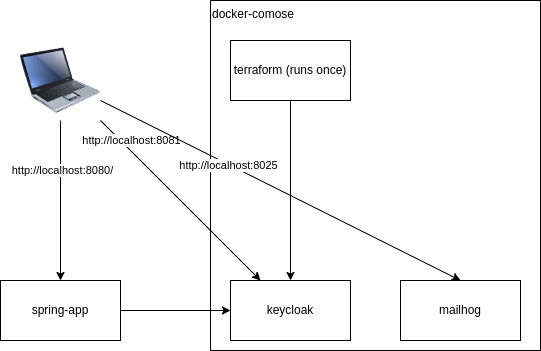

== spring oauth jwt

example for authentication with jwt and role mapping via TestRestTemplate

[source, bash]
----
docker-compose rm # remove old keycloak config
docker-compose up # takes some time until terraform can configure keycloak

# keycloak admin/admin
browser http://lcoalhost:8081/
# joe/joe
# mandy/mandy
http://localhost:8081/realms/example/account

mvn spring-boot:run

mvn test

browser http://lcoalhost:8080/
----

Infos

* https://dzone.com/articles/spring-oauth2-resource-servers
** is working if done right -> Bearer in header

* https://www.baeldung.com/spring-security-oauth-jwt
** spring boot 2

== keycloak

as openid connect implementation

== Terraform

to configure keycloak

* https://developer.hashicorp.com/terraform/intro[Intro]
* https://registry.terraform.io/providers/mrparkers/keycloak/latest/docs[keycloak provider]

[source,bash]
----
docker exec -it terraform sh

cd /opt/config
terraform init     # init workspace
terraform validate # validate config
terraform fmt      # reformat config to default layout

terraform plan --out savedPlan
terraform apply savedPlan

terraform console  # interactive
----

=== Debugging

[source,bash]
----
docker exec -it terraform sh
cd /opt/config
----